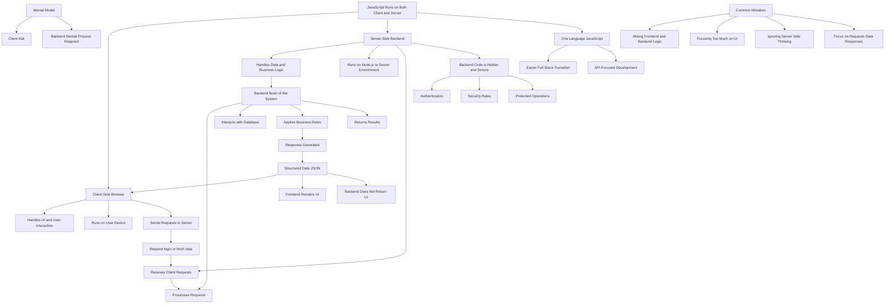

```mermaid
flowchart TB

%% Core Idea
A[JavaScript Runs on Both Client and Server]

%% Split roles
A --> B[Client-Side Browser]
A --> C[Server-Side Backend]

%% Client side
B --> B1[Handles UI and User Interaction]
B --> B2[Runs on User Device]
B --> B3[Sends Requests to Server]

%% Server side
C --> C1[Handles Data and Business Logic]
C --> C2[Runs on Node.js or Server Environment]
C --> C3[Receives Client Requests]

%% Backend as brain
C1 --> D[Backend Brain of the System]
D --> D1[Processes Requests]
D --> D2[Interacts with Database]
D --> D3[Applies Business Rules]
D --> D4[Returns Results]

%% Flow of application
B3 --> E[Request login or fetch data]
E --> C3
C3 --> D1
D3 --> F[Response Generated]
F --> G[Structured Data JSON]
G --> B

%% Output distinction
G --> H[Frontend Renders UI]
G --> I[Backend Does Not Return UI]

%% Separation of concerns
C --> J[Backend Code is Hidden and Secure]
J --> J1[Authentication]
J --> J2[Security Rules]
J --> J3[Protected Operations]

%% Shared language
A --> K[One Language JavaScript]
K --> K1[Easier Full Stack Transition]
K --> K2[API Focused Development]

%% Mental model
L[Mental Model]
L --> L1[Client Ask]
L --> L2[Backend Decide Process Respond]

%% Common mistakes
M[Common Mistakes]
M --> M1[Mixing Frontend and Backend Logic]
M --> M2[Focusing Too Much on UI]
M --> M3[Ignoring Server Side Thinking]
M --> M4[Focus on Requests Data Responses]

```
