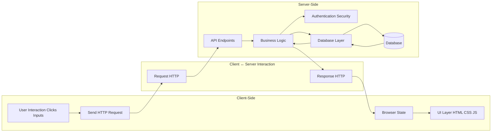

```mermaid
flowchart LR

%% Client Side
subgraph CLIENT[Client-Side]
C1[UI Layer HTML CSS JS]
C2[User Interaction Clicks Inputs]
C3[Browser State]
C4[Send HTTP Request]
end

%% Interaction
subgraph FLOW[Client ↔ Server Interaction]
F1[Request HTTP]
F2[Response HTTP]
end

%% Server Side
subgraph SERVER[Server-Side]
S1[API Endpoints]
S2[Business Logic]
S3[Authentication Security]
S4[Database Layer]
DB[(Database)]
end

%% Client flow
C2 --> C4
C4 --> F1

%% Request to server
F1 --> S1
S1 --> S2
S2 --> S3
S2 --> S4
S4 --> DB
DB --> S4
S4 --> S2

%% Response back
S2 --> F2
F2 --> C3
C3 --> C1
```
