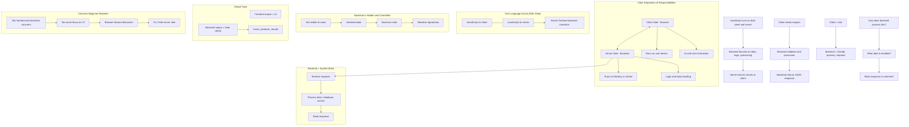

```mermaid
flowchart TD

%% =========================
%% CORE TAKEAWAY
%% =========================
A[JavaScript runs on both client and server]
B[Backend focuses on data, logic, processing]
C[Server returns results to client]

A --> B --> C

%% =========================
%% CLIENT VS SERVER
%% =========================
subgraph S1[Clear Separation of Responsibilities]

D1[Client Side - Browser]
D2[UI and User Interaction]
D3[Runs on user device]

E1[Server Side - Backend]
E2[Logic and data handling]
E3[Runs on Node.js or similar]

D1 --> D2
D1 --> D3

E1 --> E2
E1 --> E3

D1 <--> E1

end

%% =========================
%% BACKEND ROLE
%% =========================
subgraph S2[Backend = System Brain]

F1[Receive requests]
F2[Process data / database access]
F3[Send response]

F1 --> F2 --> F3

end

E1 --> F1

%% =========================
%% APPLICATION FLOW
%% =========================
G1[Client sends request]
G2[Backend validates and processes]
G3[Backend returns JSON response]

G1 --> G2 --> G3

%% =========================
%% ONE LANGUAGE
%% =========================
subgraph S3[One Language Across Both Sides]

H1[JavaScript on client]
H2[JavaScript on server]
H3[Easier frontend-backend transition]

H1 --- H2
H2 --> H3

end

%% =========================
%% BACKEND CONTROL
%% =========================
subgraph S4[Backend is Hidden and Controlled]

I1[Not visible to users]
I2[Authentication]
I3[Business rules]
I4[Sensitive operations]

I1 --> I2 --> I3 --> I4

end

%% =========================
%% OUTPUT TYPE
%% =========================
subgraph S5[Output Type]

J1[Frontend output = UI]
J2[Backend output = Data JSON]
J3[Users, products, results]

J2 --> J3

end

%% =========================
%% MENTAL MODEL
%% =========================
K1[Client = Ask]
K2[Backend = Decide, process, respond]

K1 --> K2

%% =========================
%% COMMON MISTAKES
%% =========================
subgraph S6[Common Beginner Mistakes]

L1[Mix frontend and backend concerns]
L2[Too much focus on UI]
L3[Browser feature distraction]
L4[Fix: think server side]

L1 --> L2 --> L3 --> L4

end

%% =========================
%% FINAL MINDSET
%% =========================
M1[How does backend process this?]
M2[What data is handled?]
M3[What response is returned?]

M1 --> M2 --> M3
```
