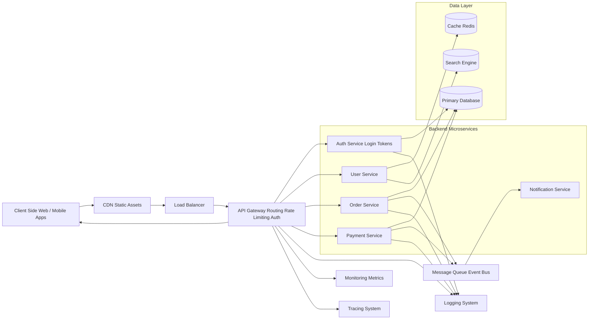
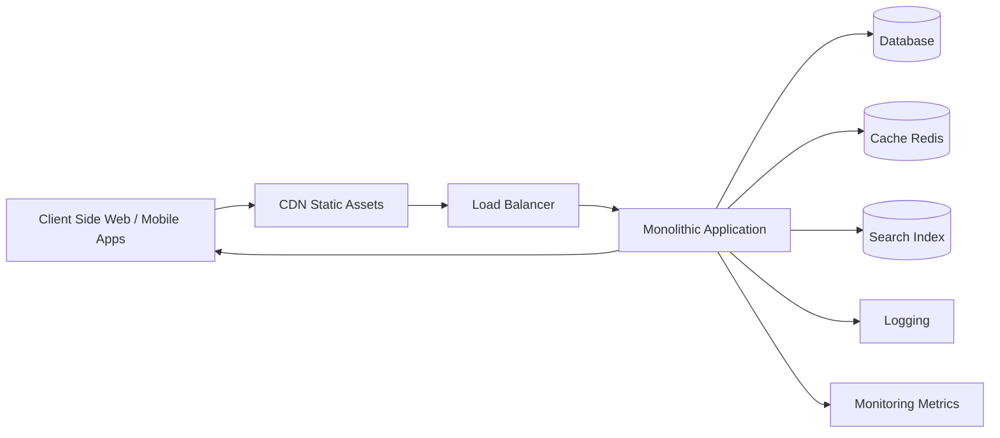

## Microservices

```
SYSTEM ARCHITECTURE DOCUMENTATION

OVERVIEW
• This architecture represents a standard distributed web application system
• It is composed of client interfaces, edge infrastructure, API gateway, backend services, data storage, asynchronous messaging, and observability systems
• The system is designed for scalability, modularity, and separation of concerns

---

CLIENT LAYER

Components
• Client Side Web Application
• Mobile Applications

Responsibilities
• Provides user interface for system interaction
• Sends requests to backend via API gateway
• Receives responses and renders results

---

EDGE LAYER

Components
• CDN (Content Delivery Network)
• Load Balancer

Responsibilities
• CDN serves static assets such as images, scripts, and frontend bundles
• Load balancer distributes incoming traffic across backend infrastructure
• Improves performance, latency, and system reliability

---

API GATEWAY LAYER

Component
• API Gateway

Responsibilities
• Routes incoming requests to appropriate backend services
• Handles authentication and authorization enforcement
• Applies rate limiting and traffic control policies
• Acts as single entry point for backend services

---

BACKEND MICROSERVICES LAYER

Components
• Authentication Service
• User Service
• Order Service
• Payment Service
• Notification Service

Responsibilities

Authentication Service
• Handles login and token generation
• Manages user identity verification

User Service
• Manages user profiles and user-related data
• Interacts with cache and database for user state retrieval

Order Service
• Handles order creation and processing
• Stores order data in database
• Publishes events to message queue

Payment Service
• Processes payment transactions
• Stores transaction records in database
• Publishes payment events to message queue

Notification Service
• Consumes events from message queue
• Sends notifications to users based on events

---

DATA LAYER

Components
• Primary Database
• Cache (Redis)
• Search Engine

Responsibilities

Primary Database
• Stores persistent application data
• Used by authentication, order, and payment services

Cache (Redis)
• Stores frequently accessed data
• Improves response time for user-related queries

Search Engine
• Provides indexing and search functionality
• Used primarily by user service for fast data retrieval

---

ASYNCHRONOUS SYSTEM LAYER

Component
• Message Queue / Event Bus

Responsibilities
• Enables asynchronous communication between services
• Decouples order and payment processing from notification system
• Ensures reliable event delivery between services

Event Flow
• Order Service publishes order events
• Payment Service publishes payment events
• Notification Service consumes events and processes notifications

---

OBSERVABILITY LAYER

Components
• Logging System
• Monitoring Metrics System
• Distributed Tracing System

Responsibilities

Logging System
• Collects logs from API gateway and backend services
• Supports debugging and audit trails

Monitoring System
• Tracks system health metrics
• Monitors API performance and service uptime

Distributed Tracing System
• Tracks request flow across services
• Helps identify latency and bottlenecks in distributed calls

---

SYSTEM FLOW SUMMARY

Request Flow
• Client sends request to CDN
• CDN forwards request to Load Balancer
• Load Balancer routes request to API Gateway
• API Gateway routes request to appropriate microservice
• Microservices interact with database, cache, or search engine
• Response flows back through API Gateway to client

Event Flow
• Services emit events to Message Queue
• Notification service consumes events asynchronously
• Notifications are processed independently of main request flow

---

DATA ACCESS PATTERN

User Service
• Reads from Cache when available
• Falls back to Database when cache miss occurs
• Queries Search Engine for indexed data retrieval

Order and Payment Services
• Write directly to Primary Database
• Publish events to Message Queue for downstream processing

Authentication Service
• Validates credentials against Primary Database
• Issues authentication tokens

---

KEY DESIGN CHARACTERISTICS

Scalability
• Microservices allow independent scaling of components
• Load balancer distributes traffic evenly

Performance
• Cache reduces database load
• CDN reduces frontend asset latency

Reliability
• Message queue ensures asynchronous fault tolerance
• Service isolation reduces cascading failures

Observability
• Centralized logging supports debugging
• Metrics system supports performance monitoring
• Tracing system enables request lifecycle tracking
```
<b>
  
## Monolith

```
Monolith Architecture

  • Flow Overview

    • Client Side (Web / Mobile Apps)
      • sends requests

    • CDN (Static Assets)
      • serves static content
      • reduces load on backend

    • Load Balancer
      • distributes incoming traffic

    • Monolithic Application
      • handles all business logic in one codebase

  • Data & Services

    • Database
      • primary data storage

    • Cache (Redis)
      • speeds up repeated reads

    • Search Index
      • enables fast search queries

  • Observability

    • Logging
      • records system activity and errors

    • Monitoring Metrics
      • tracks performance and health

  • Request Flow

    • Client → CDN → Load Balancer → Application
    • Application → Database / Cache / Search
    • Application → Logs / Monitoring
    • Application → Client (response)

  • Key Characteristics

    • Single deployable unit
    • Centralized logic
    • Simpler to start
    • Harder to scale independently

  • Tradeoffs

    • Pros
      • easier development and debugging (early stage)
      • fewer moving parts
      • simpler deployment

    • Cons
      • tight coupling of components
      • scaling requires scaling entire app
      • harder to maintain as system grows
```
