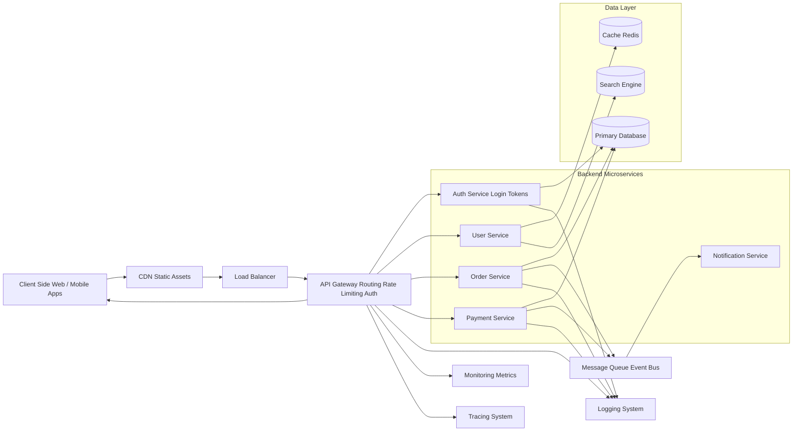
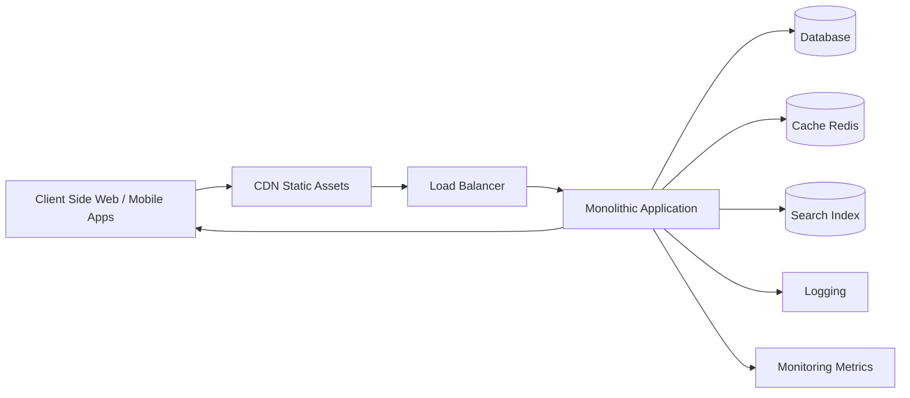

## Microservices

```mermaid
flowchart LR

%% CLIENT
CLIENT[Client Side Web / Mobile Apps]

%% EDGE LAYER
CDN[CDN Static Assets]
LB[Load Balancer]

%% API LAYER
GW[API Gateway Routing Rate Limiting Auth]

%% BACKEND SERVICES
subgraph BACKEND[Backend Microservices]
AUTH[Auth Service Login Tokens]
USER[User Service]
ORDER[Order Service]
PAYMENT[Payment Service]
NOTIF[Notification Service]
end

%% DATA LAYER
subgraph DATA[Data Layer]
DB[(Primary Database)]
CACHE[(Cache Redis)]
SEARCH[(Search Engine)]
end

%% ASYNC SYSTEM
MQ[Message Queue Event Bus]

%% OBSERVABILITY
LOGS[Logging System]
MONITOR[Monitoring Metrics]
TRACE[Tracing System]

%% FLOW
CLIENT --> CDN --> LB --> GW

GW --> AUTH
GW --> USER
GW --> ORDER
GW --> PAYMENT

USER --> CACHE
ORDER --> DB
PAYMENT --> DB
AUTH --> DB

ORDER --> MQ
PAYMENT --> MQ
MQ --> NOTIF

USER --> SEARCH

%% Observability connections (corrected)
GW --> LOGS
AUTH --> LOGS
ORDER --> LOGS
PAYMENT --> LOGS

GW --> MONITOR
GW --> TRACE

GW --> CLIENT
```
<b>
---
  
## Monolith

```mermaid
flowchart LR

CLIENT[Client Side Web / Mobile Apps]

CDN[CDN Static Assets]
LB[Load Balancer]
APP[Monolithic Application]

DB[(Database)]
CACHE[(Cache Redis)]
SEARCH[(Search Index)]

LOGS[Logging]
MONITOR[Monitoring Metrics]

CLIENT --> CDN --> LB --> APP

APP --> DB
APP --> CACHE
APP --> SEARCH

APP --> LOGS
APP --> MONITOR

APP --> CLIENT
```
