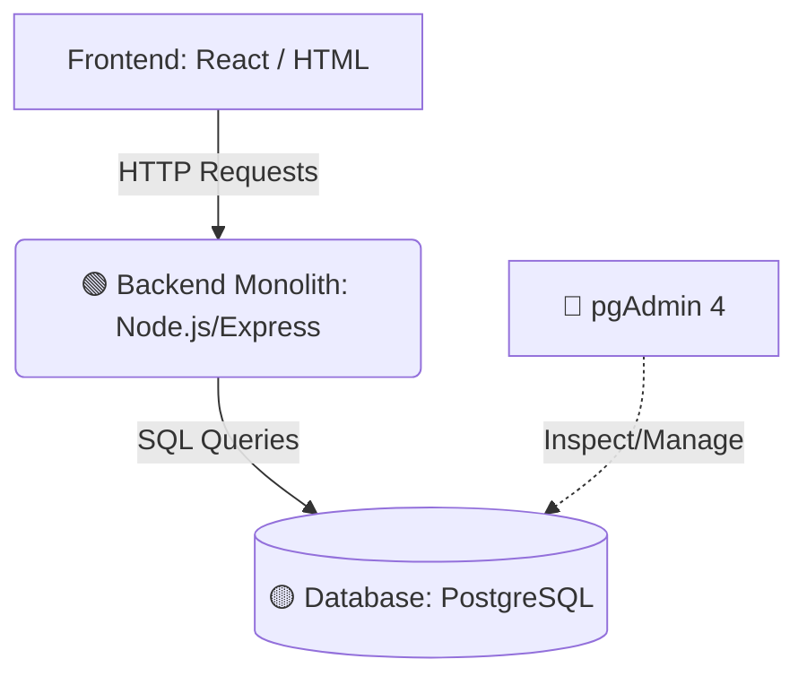

## 🧠 What a Local Monolith Setup Actually Looks Like

You can simulate a production-grade enterprise environment right on your local machine. Here is the breakdown of a classic monolithic architecture.

### 🏗️ Typical Local Monolith Stack


<br>

### 1. Backend (The Monolith)
---
**Tech:** Node.js + Express  
This is your actual "Monolith" system. It handles everything in one place:
*   **Routing:** Directing requests to the right place.
*   **Business Logic:** The "brains" of your app (e.g., calculating discounts).
*   **Authentication:** Verifying users (JWT, Cookies).
*   **Database Queries:** Communicating with PostgreSQL.
<br>

### 2. Database
---
**Tech:** PostgreSQL  
The persistent storage layer. It stores all your application data (Users, Orders, Products, etc.) in relational tables.
<br>
<br>

### 3. pgAdmin 4
---
**Tech:** GUI Management Tool  
*Note: This is **not** part of your app's runtime.*
*   View tables and schemas visually.
*   Run manual SQL queries for testing.
*   Inspect data integrity.
<br>

### 4. Optional Frontend
---
**Tech:** React, Vue, or plain HTML/CSS  
The user interface that talks to your backend via HTTP/REST.

<br>

### 🧪 What Makes it a “Monolith”?
---
Your Node.js app is considered a monolith because **one single codebase** contains all your domains:

*   `GET /users` — (User Management)
*   `POST /login` — (Auth)
*   `GET /orders` — (E-commerce Logic)

**One codebase = One deployment unit.**

<br>

### 🛠️ Example Project Structure
---
```text
project/
│
├── server.js          # Entry point (Express setup)
├── routes/            # API endpoints (User, Order, Auth routes)
├── controllers/       # Business logic (The "how-to" of your app)
├── models/            # Database schemas & queries
├── db/                # PostgreSQL connection configuration
├── .env               # Database credentials & secrets
└── package.json       # Dependencies
```

<br>

### 🔁 Local Request Flow
---
1.  **Frontend** sends a `POST /orders` request.
2.  **Express Router** receives the request in `server.js`.
3.  **Controller** validates the user's session and checks stock.
4.  **Model** executes an `INSERT` query into **PostgreSQL**.
5.  **PostgreSQL** sends a confirmation back to the Backend.
6.  **Backend** sends a `201 Created` status back to the Browser.
7.  *(Optional)* You check **pgAdmin 4** to see the new row in the table.

<br>

### 🧠 Why This Setup is Powerful
---
Building this locally allows you to simulate real enterprise behavior:

| Feature | Realistic Simulation |
| :--- | :--- |
| **Backend Realism** | API design, Auth flows, and transaction handling. |
| **Database Realism** | Relationships (FKs), Joins, Indexing, and Constraints. |
| **Debugging Realism** | Server logs, request tracing, and SQL inspection. |

<br>

### ⚠️ Key Clarification
---
| Tool | Role |
| :--- | :--- |
| **Node.js / Express** | **Backend** (The Monolith System) |
| **PostgreSQL** | **Database** (Data Storage) |
| **pgAdmin 4** | **Database Viewer** (Management Tool) |
| **VS Code** | **Development Environment** (Code Editor) |

<br>

## 🚀 Bottom Line
---
**Yes**—you can build a fully realistic monolith system locally that behaves exactly like production. It consists of one backend app, one database, real API flows, and professional debugging tools.
