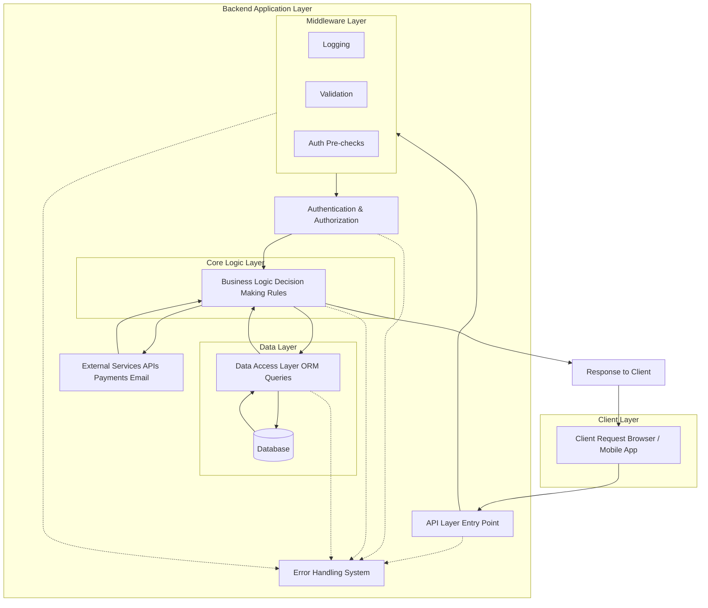

---

 
## Core Components of a Backend System
- A backend system is a pipeline that receives requests, processes data, and returns responses.
 

### 1. API Layer (Entry Point)
*   **Role:** Front door of the backend system.
*   **Common tools:** Routes, endpoints, request handlers (e.g., Express.js).
*   **Responsibilities:**
    *   Receive HTTP requests (GET, POST, etc.).
    *   Extract input (params, body, headers).
    *   Send responses back.

### 2. Business Logic Layer
*   **Role:** Decides what should happen; the core decision-making part.
*   **Responsibilities:**
    *   Apply rules.
    *   Perform calculations.
    *   Decide outcomes.
*   **Examples:**
    *   Validate login credentials.
    *   Calculate prices/discounts.
    *   Check user permissions.

### 3. Data Access Layer
*   **Role:** Manages persistent data operations; interface between logic and storage.
*   **Responsibilities:**
    *   Fetch data.
    *   Store data.
    *   Update records.
*   **Works with:**
    *   Databases (SQL / NoSQL).
    *   Queries.

### 4. Database
*   **Role:** The "memory" of the system.
*   **Types:**
    *   **Relational:** Structured tables (e.g., PostgreSQL, MySQL).
    *   **Document-based:** JSON-like structures (e.g., MongoDB).
*   **Responsibilities:**
    *   Store application data permanently.
    *   Maintain data consistency.

### 5. Authentication and Authorization Layer
*   **Role:** Security gatekeeper.
*   **Authentication:** Identifies the user (Who are you?).
*   **Authorization:** Determines permissions (What are you allowed to do?).

### 6. Error Handling System
*   **Role:** Stability and safety layer.
*   **Responsibilities:**
    *   Catch runtime errors to prevent crashes.
    *   Return safe, informative error responses.
    *   Log issues for debugging.

### 7. Middleware (Optional but Important)
*   **Role:** Processing filter layer.
*   **Responsibilities:**
    *   Runs logic between the request and the response.
    *   Logging and monitoring.
    *   Input validation.
    *   Authentication checks.

### 8. External Services (Optional)
*   **Role:** External integrations.
*   **Examples:**
    *   Payment gateways (Stripe).
    *   Email services (SendGrid).
    *   Third-party APIs.

---

### How Everything Works Together
1.  **Request** enters the **API layer**.
2.  **Middleware** processes the request (logs it, checks auth).
3.  **Business logic** executes the specific rules for that request.
4.  **Data layer** interacts with the **Database** to fetch or save info.
5.  **Response** is formatted and returned to the user.
6.  **Errors** are handled at any stage if something goes wrong.

---

### Mental Model: The Factory Pipeline
*   **API** = Entry point / Reception
*   **Middleware** = Security checkpoints
*   **Business Logic** = Assembly line
*   **Data Layer** = Retrieval system
*   **Database** = Storage warehouse
*   **Auth** = ID badge check
*   **Error Handling** = Safety emergency shut-off

> **Key Insight:** Backend development is building a structured processing pipeline, not just writing isolated code files.

**One-Line Summary:**  
A backend system is a layered pipeline that receives requests, applies logic, manages data, enforces security, and returns responses.
