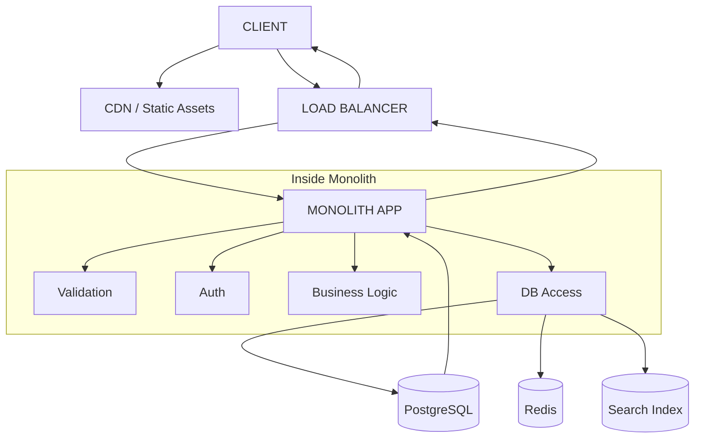
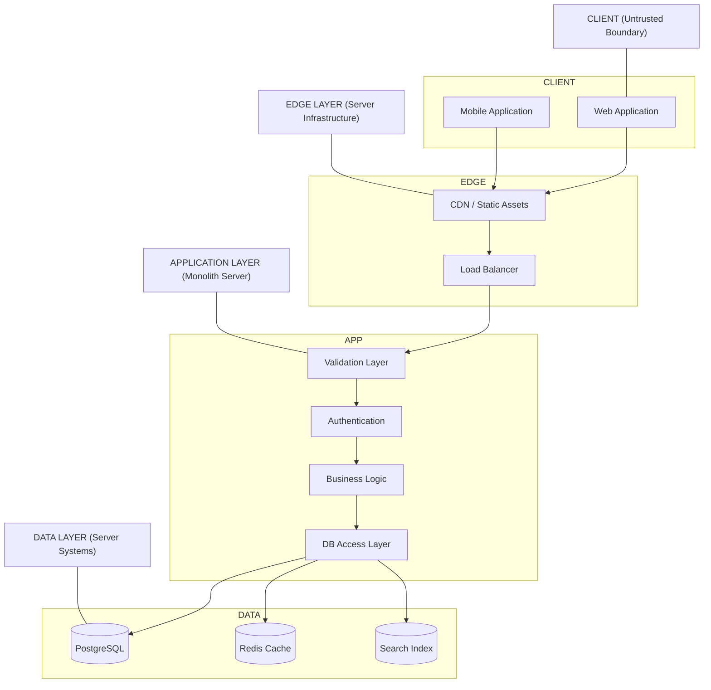

# MONOLITH INFRASTRUCTURE PHILOSOPHY

A monolith is not "simple backend code."

It is:
> 🧩 **A single executable system** that owns all business logic, all rules, and all decisions, and coordinates everything internally.

---
<br>

## 🎯 Core Philosophy

#### 1. "One brain, many responsibilities"
Instead of splitting logic across services like:
*   `auth-service`
*   `user-service`
*   `billing-service`

You have:
*   🧠 **One application** that contains all of them internally.
<br>

#### 2. "Internal communication is free"
Inside a monolith, function calls replace network calls. There is **no HTTP overhead** between modules.

*   **So:** `userService.createUser()` → *Direct function call*
*   **Not:** An HTTP request to another service.
<br>

#### 3. "Data consistency is easier"
Because everything shares the:
*   Same runtime
*   Same database connection rules
*   Same transaction boundary

You can enforce **ACID-level correctness** without distributed complexity.
<br>
<br>
<br>

#### 4. "Complexity is postponed, not removed"
Monoliths are:
*   ✅ Easy at the start.
*   ❌ Harder as they grow.

**The key idea:** You trade early simplicity for future restructuring flexibility.
<br>
<br>
<br>

#### 5. "Boundaries are logical, not physical"
- You still structure code like microservices (e.g., `auth` module, `user` module, `payment` module), but they all live inside **one codebase**.

---
<br>

## YOUR SYSTEM (MENTAL MODEL)

- Let’s imagine a **User Management + Simple E-commerce System**.
<br>

#### 🌐 1. CLIENT LAYER (Web / Mobile)
---
**What it is:** The UI (Browser or Mobile App).

**Scenario:**
A user opens your app and says: *"I want to buy headphones."*
1. Search products.
2. Click product.
3. Place order.

**What the client does NOT do:**
*   ❌ Does NOT validate business rules.
*   ❌ Does NOT access the database.
*   ❌ Does NOT decide pricing.
*   ✅ It only **sends requests** and **displays results**.
<br>

#### 🌍 2. EDGE LAYER (CDN + Load Balancer)
---
#### A. CDN (Content Delivery Network)
*   **Role:** Serves static assets (JS bundle, images, CSS).
*   **Scenario:** Instead of your server sending `logo.png`, the CDN has it cached nearby for fast loading.

#### B. Load Balancer
*   **Role:** Distributes incoming requests.
*   **Scenario:** If you have 3 backend instances (App A, B, and C), the Load Balancer sends the request to the instance that is least busy.
<br>

#### 🧠 3. APPLICATION LAYER (MONOLITH CORE) 
---
This is the **entire brain** of your system.

#### Modules inside the Monolith:
1.  **Auth Module:** Login, register, password hashing, JWT creation.
2.  **User Module:** Profiles, updates, lookups.
3.  **Product Module:** Listings, search, details.
4.  **Order Module:** Place order, calculate total, validate stock.
<br>

## SCENARIO FLOW (VERY IMPORTANT)

#### 🎯 Case Study: User places an order

1.  **Request arrives:**
    Client sends:
    ```json
    POST /orders
    {
      "userId": 1,
      "productId": 10,
      "quantity": 2
    }
    ```
2.  **Load Balancer forwards request:** → Monolith App receives it.
3.  **Application layer starts processing:**
    *   **A. Validation layer:** Checks if `userId` is valid and `quantity > 0`.
    *   **B. Business logic:** Fetches price, checks stock, calculates total.
    *   **C. Auth check:** Is the user logged in?
    *   **D. Order creation:** Creates the record and reduces stock.
4.  **Database interaction:** 
    *   `INSERT INTO orders ...`
    *   `UPDATE products SET stock = stock - 2`
5.  **Response returned:** `200 OK` with order details.
<br>

#### 🗄️ 4. DATA LAYER
---
*   **PostgreSQL (Primary DB):** The system of record for users, products, and orders.
*   **Cache (Redis):** Speed layer. Returns search results instantly instead of querying the DB every time.
*   **Search Index:** Fast search engine for queries like `"head"` → `headphones`.
<br>

#### 📊 5. OBSERVABILITY LAYER
---
The "nervous system" of your app.

*   **Logging System:** Traces what happened (e.g., `ERROR: stock not available`).
*   **Metrics System:** Tracks request latency, error rates, and CPU usage.
<br>

### 🔁 FULL SYSTEM FLOW (COMPLETE VIEW)



```
MONOLITH ARCHITECTURE FLOW DOCUMENTATION

---

SYSTEM OVERVIEW

    • This diagram represents a monolithic application architecture
    • The system processes client requests through an edge layer and a single backend application
    • All business logic, validation, authentication, and data access occur inside one application boundary

---

CLIENT LAYER

    Client
        • Entry point for system interaction
        • Represents web or mobile applications
        
    Responsibilities
        • Initiates requests to backend system
        • Receives and renders responses
        • Does not perform business logic or data processing

---

EDGE LAYER

    CDN / Static Assets
        • Serves static frontend resources
        • Includes images, scripts, and stylesheets
        • Reduces load on backend system
    
    Load Balancer
        • Distributes incoming traffic
        • Routes requests to monolithic application
        • Improves availability and request handling

---

APPLICATION LAYER (MONOLITH CORE)

    Monolithic Application
        • Single backend system containing all core logic
        
    Internal Components
    
    Validation Layer
        • Validates incoming request data
        • Ensures required fields and constraints are satisfied
    
    Authentication Layer
        • Handles user identity verification
        • Processes login sessions and tokens
    
    Business Logic Layer
        • Executes core application rules
        • Handles domain logic such as orders, pricing, and processing rules
    
    Database Access Layer
        • Interfaces with storage systems
        • Performs read and write operations

---

DATA LAYER

    PostgreSQL (Primary Database)
        • Stores persistent structured data
        • System of record for users, orders, and application state
    
    Redis (Cache Layer)
        • Provides fast in-memory data access
        • Reduces database query load
        • Improves performance for repeated queries
    
    Search Index
        • Supports fast query and search operations
        • Enables efficient retrieval of product or structured data

---

SYSTEM FLOW

    Request Flow
        • Client sends request to system
        • Request passes through CDN (if static content is required)
        • Load balancer routes request to monolithic application
        • Monolith processes request internally:
          • validation
          • authentication
          • business logic execution
          • database access
        • Data layer is accessed when required
        • Response is returned through load balancer back to client
    
    Response Flow
        • Database results are processed inside monolith
        • Application constructs response payload
        • Response is sent back through load balancer
        • Client receives final output

---

KEY ARCHITECTURAL CHARACTERISTICS

    Design Type
        • Monolithic architecture with layered internal structure
        
    Strengths
        • Single deployment unit
        • Low internal communication overhead
        • Strong transactional consistency
        • Simplified system coordination
    
    Constraints
        • Scaling requires full application replication
        • Internal modules are tightly coupled at runtime
        • Growth increases internal complexity within single system boundary

---
```
---
<br>

### 🚀 NEXT STEP: YOUR PROJECT

Since you already have **PostgreSQL**, **VS Code**, and **Deno**, we will build a:
#### 🧪 "Monolith Backend Simulator"

**We will implement:**
1.  HTTP server (Deno)
2.  Auth module
3.  User module
4.  Product module
5.  PostgreSQL connection
6.  Basic validation layer
7.  Logging system
