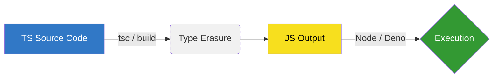

# 🧠 The TypeScript Paradox: The Disappearing Layer

### *Understanding Type Erasure & The Blueprint Analogy*

One of the biggest hurdles for developers is realizing that **TypeScript does not exist at runtime.** To master backend architecture, you must understand that TypeScript is a "compile-time assistant" that vanishes before your code ever hits the server.

---

## 🏗️ The "Erasable Notes" Analogy

Think of TypeScript as a **blueprint with detailed sticky notes**.

*   **TypeScript:** The blueprint with labels, constraints, and measurements (e.g., *"This pipe must be 2-inch PVC"*).
*   **JavaScript:** The actual building constructed after **ignoring and throwing away all the sticky notes.**

### Example: The Transformation

**1. The Code You Write (TypeScript)**
```typescript
function add(a: number, b: number): number {
  return a + b;
}
```
*TypeScript checks: "Are `a` and `b` numbers? Does this return a number?"*

**2. The Code That Runs (JavaScript)**
```javascript
function add(a, b) {
  return a + b;
}
```
👉 **The notes (types) are gone.**
👉 **The structure (logic) remains.**

---

## ⚙️ The Three-Layer Mental Model

To understand how your backend actually operates, separate it into these three distinct stages:

### 1. The Language (The Authoring Layer)
**TypeScript.** This is where you spend your time. It adds interfaces, types, and advanced tooling to ensure your modules (Auth, Orders, Products) talk to each other correctly.

### 2. The Transformation (The Preprocessor)
**The Compiler (`tsc`, `esbuild`, `swc`).** This step acts as a "strict preprocessor." It:
*   Enforces your rules.
*   **Strips away all metadata.**
*   Rewrites your code into clean JavaScript.

### 3. The Runtime (The Execution Layer)
**Node.js or Deno.** These environments **only execute JavaScript.**
*   They don't know what an `interface` is.
*   They don't care about `private` or `public` modifiers.
*   They only see the raw logic.

---

## ⚡ The "Deno" Trap: Why Beginners Get Confused

When you run a command like `deno run app.ts`, it *looks* like TypeScript is being interpreted directly. 

**The Reality:** 
Under the hood, the engine transpiles `TS → JS` in a temporary space and then runs the JS. You just don't see the middle step. **TypeScript is never executed.**

---

## 🧩 Systems Analogies (For Senior Engineers)

If you need a deeper comparison, think of TypeScript in these terms:

| Comparison | TypeScript Side | JavaScript/Runtime Side |
| :--- | :--- | :--- |
| **Databases** | **SQL Schema** (Constraints) | **Raw Data Operations** (I/O) |
| **Low-Level** | **Static Analysis** (Linting) | **Machine Code** (Execution) |
| **Manufacturing** | **Quality Control Checklist** | **The Final Product** |

---

## 🏗️ Relating to Monolithic Architecture

In a large backend monolith, your modules (Auth, Order, Product) are tightly coupled via function calls.

**In TypeScript:**
You ensure that `createOrder(userId: number, productId: number)` is called with the correct IDs across the entire system. If you try to pass a `string`, the "blueprint" catches the error.

**At Runtime:**
The safety net is gone. If a raw API request bypasses your **Runtime Validation** and sends a string into that function, JavaScript will attempt to process it, likely leading to a database error or a `NaN` result.

> **Key Insight:** TypeScript ensures your internal modules connect correctly, but it cannot protect you from external data once the "notes" are erased.

---

## 🧭 Final Mental Model



1.  **TypeScript** is the architect’s validation.
2.  **Transpilation** is the process of stripping the labels.
3.  **JavaScript** is the real language of execution.

**Conclusion:** TypeScript is a powerful assistant that helps you build a safe system, but it **disappears** the moment the work starts. Use it to design the structure, but use **Runtime Validation** to guard the doors.
