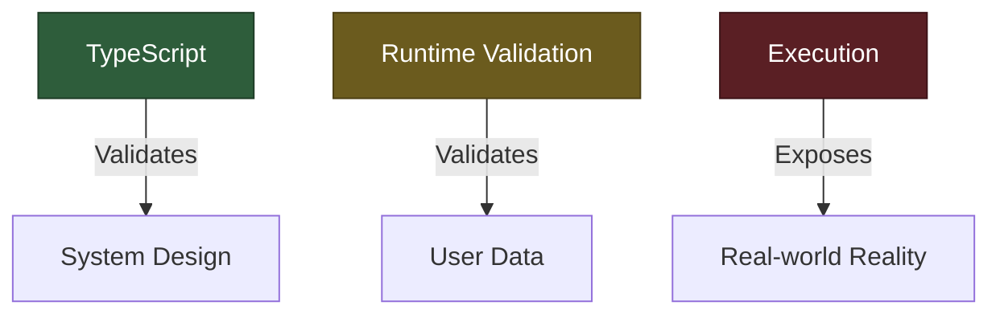

# 🧠 TypeScript vs. Runtime Validation vs. Execution

### *A Clean Architecture Analogy for Backend Systems*
---
In backend systems, correctness is enforced at multiple layers. These layers operate at different times, with different responsibilities, and different levels of trust. To understand this clearly, we map them to a **building construction analogy**.
 

### 🏗️ Overview
---
| Layer | Analogy | Timing | Focus |
| :--- | :--- | :--- | :--- |
| **🟢 TypeScript** | Architect reviewing blueprints | **Design-Time** | Structural Integrity |
| **🟡 Runtime Validation** | Engineers inspecting construction | **Request-Time** | Data Integrity |
| **🔴 Execution** | People living in the building | **Production** | Real-world Reality |
 

### 🟢 1. TypeScript (Design-Time Validation Layer)
---
> **Analogy:** *The Architect reviewing blueprints before construction starts.*

At this stage, nothing is built yet. Only the design exists. The architect ensures that the system is structurally sound before a single brick is laid.

#### 🧠 Responsibilities
*   **Design Consistency:** Checks that the logic follows the blueprint.
*   **Structural Correctness:** Ensures types match across the entire codebase.
*   **Relationship Validation:** Validates how different components (classes, interfaces, functions) talk to each other.
*   **Prevention:** Stops "impossible" designs from reaching the compiler.

#### 💡 What this means in software
TypeScript checks your **code structure**, not **real data**. It verifies:
- Function inputs/outputs match expected types.
- Modules interact correctly.
- Data models are consistent across the monolith.

#### 🚫 What TypeScript does NOT do
*   Does **NOT** run your program.
*   Does **NOT** process real user input (e.g., an email string is just a `string` to TS, not necessarily a valid email).
*   Does **NOT** interact with live databases or APIs.

> **Key Idea:** TypeScript validates whether your system **can exist** correctly, not whether it runs correctly.
 

### 🟡 2. Runtime Validation (Backend / Frontend Layer)
---
> **Analogy:** *Engineers inspecting the building while it is being constructed.*

At this stage, the system is actively running. Real inputs, real conditions, and real-world behavior are involved.

#### 🧠 Responsibilities
*   **Input Validation:** Checking the actual data sent by a user.
*   **Execution Integrity:** Ensuring data remains valid while being moved.
*   **Business Rules:** Dynamically applying logic (e.g., "Is the user over 18?").
*   **Error Handling:** Managing malformed or malicious data.

#### 💡 What this means in software
Runtime validation (using tools like Zod, Joi, or custom logic) checks:
- **API Payloads:** Is the `email` field actually a valid email format?
- **Business Constraints:** Is the `order_quantity` greater than zero?
- **Security:** Are there unauthorized fields in the request?

> **Key Idea:** Runtime validation ensures correctness while the system is **actively processing real data**.
 

### 🔴 3. Execution (Production System Layer)
---
> **Analogy:** *People living inside the completed building.*

The system is fully built, deployed, and being used. This is where the "theory" meets the "reality."

#### 🧠 Responsibilities
*   **Traffic Management:** Handling real user requests.
*   **Operations:** Processing business transactions.
*   **Resilience:** Running under load and handling unexpected environment failures.

#### 💡 What this means in software
This is the live system in action:
- APIs serving thousands of users.
- Databases storing and retrieving production records.
- Services handling edge cases that weren't predicted in the blueprint.

⚠️ **The Reality:** Even with perfect design (TypeScript) and perfect inspection (Validation), systems can still fail due to network outages, database deadlocks, or hardware limits.

---
 

### 🧩 Key Insight: The "Inspection" Fallacy

**TypeScript does NOT inspect a running system.**

It is a common misconception that TypeScript "watches" the data in your production app. It doesn't. Instead, it validates whether the **system design is safe enough to run** before the first line of code is ever executed.

---
 

### 🧠 Why This Matters for Monolithic Architecture

Monolithic backend systems resemble a single large building with tightly connected internal structures.

1.  **Interconnected Modules:** Like rooms in a house sharing the same plumbing.
2.  **Shared Data Models:** The foundation upon which the entire building sits.
3.  **Strict Relationships:** Load-bearing structures that cannot be moved without affecting the whole.

### 🧱 How TypeScript helps the Monolith
TypeScript ensures that as the monolith grows:
- Modules connect correctly.
- Data structures remain consistent across the entire system.
- Services interact safely without breaking distant parts of the app.

---

## 🏁 Summary

| Layer | Purpose |
| :--- | :--- |
| **🟢 TypeScript** | Ensures the **Architecture** is logical. |
| **🟡 Runtime Validation** | Ensures the **Data** is safe. |
| **🔴 Execution** | Ensures the **Business** is running. |

> **Final Architectural Insight:** TypeScript acts as a structural integrity system for your backend design *before* deployment, ensuring your monolith is logically consistent before it ever touches a real user.
